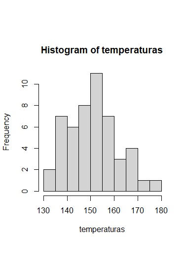
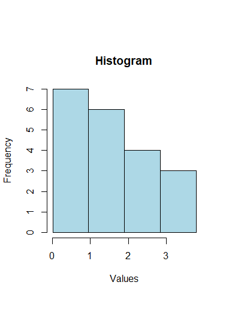
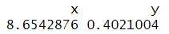
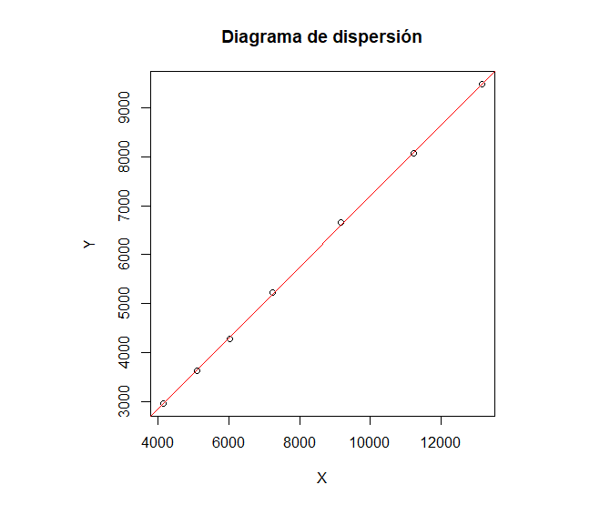
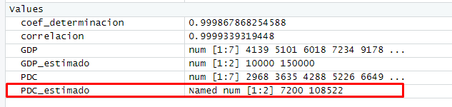
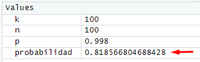
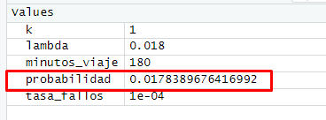

---
---
---

# Fichero 0. R- Introducción. {#Introduccion_R}

## Ejercicio 1

Se ha medido el tiempo de reparación (en horas) y el coste (en euros) de un conjunto de instrumentos electrónicos. Los tiempos de reparación de varios instrumentos elegidos al azar es el siguiente:

`159, 280, 101, 212, 224, 379, 179, 264`

Y sus costes:

`23.12, 43.15, 34.95, 54.23, 65.65, 22.45, 45.78, 87.65`

Escriba el código necesario para:

-   Crear un vector con los tiempos de reparación y otro con los costes.

    ```{r, echo = TRUE, eval = TRUE}
    # Datos de los tiempos de reparación y costes 

    tiempos_reparacion <- c(159, 280, 101, 212, 224, 379, 179, 264) 
    costes <- c(23.12, 43.15, 34.95, 54.23, 65.65, 22.45, 45.78, 87.65) 
    ```

-   Utilizar las funciones min y max para identificar el tiempo de reparación más alto y más bajo.

    *Minimo*

    ```{r, echo = TRUE, eval = TRUE}
    tiempo_minimo <- min(tiempos_reparacion) 
    ```

    *Maximo*

    ```{r, echo = TRUE, eval = TRUE}
    tiempo_maximo <- max(tiempos_reparacion) 
    ```

-   Identificar las posiciones en el vector que ocupan los costes de reparación mínimo y máximo.

    Obs: Existen diversas alternativas. Si se decanta por evaluar la condición de igualdad recuerde que el operador es == (no confundir con =).

    ```{r, echo = TRUE, eval = TRUE}
    posicion_coste_minimo <- which(costes == min(costes)) 
    posicion_coste_maximo <- which(costes == max(costes)) 
    ```

-   Transformar el vector de tiempos en un nuevo vector en el que los tiempos de reparación se expresen en días.

    ```{r, echo = TRUE, eval = TRUE}
    tiempos_reparacion_dias <- tiempos_reparacion / 24 
    ```

-   Eliminar de dicho vector los valores mínimo y máximo. Obs: para eliminar más de un elemento de un vector, además de usar el signo - es necesario "combinar" vector[c(-i, -j)].

    ```{r, echo = TRUE, eval = TRUE}
    tiempos_reparacion_filtrados <- tiempos_reparacion[
      -c( which(
          tiempos_reparacion==min(tiempos_reparacion)),
          which(tiempos_reparacion==max(tiempos_reparacion))
        )
    ] 
    ```

-   Crear un nuevo data frame llamado reparaciones que contenga los datos de tiempo y costes de todos los instrumentos.

    ```{r, echo = TRUE, eval = TRUE}
    reparaciones <- data.frame(Tiempo = tiempos_reparacion, Coste = costes)
    ```

-   ¿Cuáles son los nombres de las columnas del nuevo data frame?

    ```{r, echo = TRUE, eval = TRUE}
    nombres_columnas <- colnames(reparaciones)
    ```

-   Acceder a los datos de reparaciones de los instrumentos impares.\
    *`Ayuda: por ejemplo seq(from = ..., to = ..., by = ...).`*

    ```{r, echo = TRUE, eval = TRUE}
    reparaciones_impares <- reparaciones[seq(1, nrow(reparaciones), by = 2), ]
    ```

## Ejercicio 2

Realice el mismo estudio acerca del contenido del data frame `ToothGrowth`

``` {#dataframe .R .Toothgrowth style="color: gray;"}
# Dataframe
> ToothGrowth[]

len supp dose 
1   4.2   VC  0.5 
2  11.5   VC  0.5 
3   7.3   VC  0.5 
4   5.8   VC  0.5 
5   6.4   VC  0.5 
6  10.0   VC  0.5 
7  11.2   VC  0.5 
8  11.2   VC  0.5 
9   5.2   VC  0.5 
10  7.0   VC  0.5 
11 16.5   VC  1.0 
12 16.5   VC  1.0 
13 15.2   VC  1.0 
14 17.3   VC  1.0 
15 22.5   VC  1.0 
16 17.3   VC  1.0 
17 13.6   VC  1.0 
18 14.5   VC  1.0 
19 18.8   VC  1.0 
20 15.5   VC  1.0 
21 23.6   VC  2.0 
22 18.5   VC  2.0 
23 33.9   VC  2.0 
24 25.5   VC  2.0 
25 26.4   VC  2.0 
26 32.5   VC  2.0 
27 26.7   VC  2.0 
28 21.5   VC  2.0 
29 23.3   VC  2.0 
30 29.5   VC  2.0 
31 15.2   OJ  0.5 
32 21.5   OJ  0.5 
33 17.6   OJ  0.5 
34  9.7   OJ  0.5 
35 14.5   OJ  0.5 
36 10.0   OJ  0.5 
37  8.2   OJ  0.5 
38  9.4   OJ  0.5 
39 16.5   OJ  0.5 
40  9.7   OJ  0.5 
41 19.7   OJ  1.0 
42 23.3   OJ  1.0 
43 23.6   OJ  1.0 
44 26.4   OJ  1.0 
45 20.0   OJ  1.0 
46 25.2   OJ  1.0 
47 25.8   OJ  1.0 
48 21.2   OJ  1.0 
49 14.5   OJ  1.0 
50 27.3   OJ  1.0 
51 25.5   OJ  2.0 
52 26.4   OJ  2.0 
53 22.4   OJ  2.0 
54 24.5   OJ  2.0 
55 24.8   OJ  2.0 
56 30.9   OJ  2.0 
57 26.4   OJ  2.0 
58 27.3   OJ  2.0 
59 29.4   OJ  2.0 
60 23.0   OJ  2.0
```

Intente explicar cuáles son los resultados de las siguientes instrucciones:

``` {.R style="color: blue;"}
ToothGrowth[1:10, ]
ToothGrowth$supp == "VC"
ToothGrowth[ToothGrowth$supp == "VC", ]
ToothGrowth[ToothGrowth$supp != "VC", ]
ToothGrowth[ToothGrowth$len>10, 2]
ToothGrowth[ToothGrowth$len>10 & ToothGrowth$dose == 0.5, 2]
which(ToothGrowth$len>10 & ToothGrowth$dose == 0.5)
```

Con los datos proporcionados del data frame "ToothGrowth", se tiene que:

1\. **\`ToothGrowth[1:10, ]\`**: Muestra las primeras 10 filas de todas las columnas del data frame. Incluye la longitud de crecimiento (len), el tipo de suplemento (supp) y la dosis (dose) para cada fila.

```{=json}
ToothGrowth[1:10,]
    len supp dose
1   4.2   VC  0.5
2  11.5   VC  0.5
3   7.3   VC  0.5
4   5.8   VC  0.5
5   6.4   VC  0.5
6  10.0   VC  0.5
7  11.2   VC  0.5
8  11.2   VC  0.5
9   5.2   VC  0.5
10  7.0   VC  0.5
```
2\. **\`ToothGrowth\$supp == "VC"\`:** Compara si los valores en la columna "supp" del data frame "ToothGrowth" son iguales a "VC". Devuelve un vector que indica qué filas cumplen con esta condición. Verificará si el suplemento es "VC" para cada fila.

```{=json}
ToothGrowth$supp == "VC"
 [1]  TRUE  TRUE  TRUE  TRUE  TRUE  TRUE  TRUE  TRUE  TRUE  TRUE  TRUE  TRUE  TRUE  TRUE  TRUE  TRUE  TRUE  TRUE  TRUE  TRUE  TRUE  TRUE  TRUE  TRUE  TRUE  TRUE  TRUE  TRUE  TRUE
[30]  TRUE FALSE FALSE FALSE FALSE FALSE FALSE FALSE FALSE FALSE FALSE FALSE FALSE FALSE FALSE FALSE FALSE FALSE FALSE FALSE FALSE FALSE FALSE FALSE FALSE FALSE FALSE FALSE FALSE
[59] FALSE FALSE
```
3\. **\`ToothGrowth[ToothGrowth\$supp == "VC", ]\`**: Selecciona todas las filas del data frame "ToothGrowth" donde los valores en la columna "supp" son iguales a "VC". Muestra todas las columnas para las filas donde se utilizó el suplemento "VC".

```{=json}
 ToothGrowth[ToothGrowth$supp == "VC", ]
    len supp dose
1   4.2   VC  0.5
2  11.5   VC  0.5
3   7.3   VC  0.5
4   5.8   VC  0.5
5   6.4   VC  0.5
6  10.0   VC  0.5
7  11.2   VC  0.5
8  11.2   VC  0.5
9   5.2   VC  0.5
10  7.0   VC  0.5
11 16.5   VC  1.0
12 16.5   VC  1.0
13 15.2   VC  1.0
14 17.3   VC  1.0
15 22.5   VC  1.0
16 17.3   VC  1.0
17 13.6   VC  1.0
18 14.5   VC  1.0
19 18.8   VC  1.0
20 15.5   VC  1.0
21 23.6   VC  2.0
22 18.5   VC  2.0
23 33.9   VC  2.0
24 25.5   VC  2.0
25 26.4   VC  2.0
26 32.5   VC  2.0
27 26.7   VC  2.0
28 21.5   VC  2.0
29 23.3   VC  2.0
30 29.5   VC  2.0
```
4\. **\`ToothGrowth[ToothGrowth\$supp != "VC", ]\`**: Selecciona todas las filas del data frame donde los valores en la columna "supp" no son iguales a "VC". Muestra todas las columnas para esas filas donde no se utilizó el suplemento "VC".

```{=json}
ToothGrowth[ToothGrowth$supp != "VC", ]
    len supp dose
31 15.2   OJ  0.5
32 21.5   OJ  0.5
33 17.6   OJ  0.5
34  9.7   OJ  0.5
35 14.5   OJ  0.5
36 10.0   OJ  0.5
37  8.2   OJ  0.5
38  9.4   OJ  0.5
39 16.5   OJ  0.5
40  9.7   OJ  0.5
41 19.7   OJ  1.0
42 23.3   OJ  1.0
43 23.6   OJ  1.0
44 26.4   OJ  1.0
45 20.0   OJ  1.0
46 25.2   OJ  1.0
47 25.8   OJ  1.0
48 21.2   OJ  1.0
49 14.5   OJ  1.0
50 27.3   OJ  1.0
51 25.5   OJ  2.0
52 26.4   OJ  2.0
53 22.4   OJ  2.0
54 24.5   OJ  2.0
55 24.8   OJ  2.0
56 30.9   OJ  2.0
57 26.4   OJ  2.0
58 27.3   OJ  2.0
59 29.4   OJ  2.0
60 23.0   OJ  2.0
```
5\. **\`ToothGrowth[ToothGrowth\$len \> 10, 2]\`:** Selecciona la columna 2 (llamada "supp") del data frame "ToothGrowth" para todas las filas donde los valores en la columna "len" son mayores que 10. Esto mostrará el suplemento utilizado en aquellas filas donde la longitud de crecimiento es mayor que 10.

```{=json}
ToothGrowth[ToothGrowth$len > 10, 2]
 [1] VC VC VC VC VC VC VC VC VC VC VC VC VC VC VC VC VC VC VC VC VC VC VC OJ OJ OJ OJ OJ OJ OJ OJ OJ OJ OJ OJ OJ OJ OJ OJ OJ OJ OJ OJ OJ OJ OJ OJ OJ
Levels: OJ VC
```
6\. **\`ToothGrowth[ToothGrowth\$len \> 10 & ToothGrowth\$dose == 0.5, 2]\`**: Selecciona la columna 2 (llamada "supp") del data frame "ToothGrowth" para todas las filas donde los valores en la columna "len" son mayores que 10 y los valores en la columna "dose" son iguales a 0.5. Mostrará el suplemento utilizado en aquellas filas donde la longitud de crecimiento es mayor que 10 y la dosis es igual a 0.5.

```{=tex}
 ToothGrowth[ToothGrowth$len > 10 & ToothGrowth$dose == 0.5, 2]
[1] VC VC VC OJ OJ OJ OJ OJ
Levels: OJ VC
```
7\. **\`which(ToothGrowth\$len \> 10 & ToothGrowth\$dose == 0.5)\`**: Devuelve los índices de las filas donde los valores en la columna "len" son mayores que 10 y los valores en la columna "dose" son iguales a 0.5. Indica qué filas cumplen con esta condición y se usan como índices para acceder a los datos en esas filas.

```{=json}
 which(ToothGrowth$len > 10 & ToothGrowth$dose == 0.5)
[1]  2  7  8 31 32 33 35 39
```
# Fichero R. Estadística Descriptiva. {#Est.Descriptiva}

## Ejemplo Nile

Con el código: "histog_Nilo \<- hist(Nile)" vemos que se imprime una grafica que ya se encuentra guardada en los datos de R-Studio el cual muestra los datos anuales del flujo del río Nilo a su paso por la presa de Asuán.

*Vamos a analizar los componentes de hist:*

-   Breaks:

Al escribir el código `histog_Nilo$breaks` se muestra lo siguiente:

```{=tex}
> histog_Nilo$breaks
 [1]  400  500  600  700  800  900 1000 1100 1200 1300 1400
```
Esto quiere decir que al añadir el break lo que se nos muestra son los puntos de corte.

-   Counts:

Al escribir el código `histog_Nilo$counts` se muestra lo siguiente:

```{=tex}
 histog_Nilo$counts
 [1]  1  0  5 20 25 19 12 11  6  1
```
Esto quiere decir que al añadir el counts se muestra el numero de datos incluidos en cada clase.

-   Density:

Al escribir el código `histog_Nilo$density` se muestra lo siguiente:

```{=tex}
histog_Nilo$densit
 [1] 0.0001 0.0000 0.0005 0.0020 0.0025 0.0019 0.0012 0.0011 0.0006 0.0001
```
Esto quiere decir que al añadir el density se muestra un vector que contiene los valores de densidad de probabilidad estimados para cada intervalo en el histograma.

-   Mids:

Al escribir el código `histog_Nilo$mids` se muestra lo siguiente:

```{=tex}
histog_Nilo$mids
 [1]  450  550  650  750  850  950 1050 1150 1250 1350
```
Esto quiere decir que al añadir el mids se muestra un vector que contiene los valores medios de cada agrupación

-   Xname:

Al escribir el código `histog_Nilo$xname` se muestra lo siguiente:

```{=tex}
 histog_Nilo$xname
[1] "Nile"
```
Esto quiere decir que al añadir el xname se muestra el nombre dela variable representada en el gráfico.

-   Equidist:

Al escribir el código `histog_Nilo$equidist` se muestra lo siguiente:

```{=tex}
histog_Nilo$equidist
[1] TRUE
```
Esto quiere decir que al añadir el equidist muestra si los valores en el eje x del grafico son equidistantes, al salir que es TRUE significa que los valores en el eje x son equidistantes.

# Ejercicio 2.1

## Ejercicio 2.1 Fichero Ejercicios [M] 2-1 2c con R.

Given the following values corresponding to the temperatures reaching a set of motherboards in extreme conditions:

```{=asciidoc}
138, 167, 151, 170, 175, 138, 148, 153, 178, 142, 

137, 157, 145, 146, 148, 155, 167, 142, 154, 133, 

133, 152, 157, 149, 169, 159, 148, 150, 153, 145, 

140, 161, 156, 149, 152, 140, 146, 151, 143, 140, 

152, 138, 160, 153, 165, 157, 158, 162, 155, 144
```
-   Desde R crear un fichero.txt introducir los datos brutos de las temperaturas y guardarlo

```{r, echo = TRUE, eval = TRUE}
# Datos de las temperaturas
temperaturas <- c(138, 167, 151, 170, 175, 138, 148, 153, 178, 142,
                  137, 157, 145, 146, 148, 155, 167, 142, 154, 133,
                  133, 152, 157, 149, 169, 159, 148, 150, 153, 145,
                  140, 161, 156, 149, 152, 140, 146, 151, 143, 140,
                  152, 138, 160, 153, 165, 157, 158, 162, 155, 144)

intervalos <- cut(temperaturas, breaks = c(131.5, 137.5, 143.5, 149.5, 155.5, 161.5, 167.5, 173.5, 179.5))

# Crear el archivo de texto
write.table(intervalos, "temperaturas.txt", row.names = FALSE, col.names = FALSE, quote = FALSE)

# Mensaje de confirmación
print("El archivo 'temperaturas.txt' ha sido creado y guardado correctamente.")
```

-   Programar el histograma en un fichero .R

```{r, echo = TRUE, eval = TRUE}

# Crear el histograma
histograma <- hist(temperaturas)

# Guardar el histograma en un archivo .R
save(histograma, file = "histograma.R")

# Mensaje de confirmación
print("El archivo 'histograma.R' ha sido creado y guardado correctamente.")
```

{width="225"}

-   Encontrar con R- las distribuciones de frecuencias absolutas y relativas, los límites de intervalos y las marcas de clase. Utilizar R para decidir si la agrupación es con rango constante o variable

    [Ver fichero](Fichero2.1-Eje-2.2.R){#Fichero R ejecutable}

```{=tex}
Límites FrecuenciaAbsoluta.intervalos FrecuenciaAbsoluta.Freq FrecuenciaRelativa.intervalos FrecuenciaRelativa.Freq MarcaClase
(132,138] (132,138]                     (132,138]                       3                     (132,138]                    0.06         NA
(138,144] (138,144]                     (138,144]                       9                     (138,144]                    0.18         NA
(144,150] (144,150]                     (144,150]                      10                     (144,150]                    0.20         NA
(150,156] (150,156]                     (150,156]                      12                     (150,156]                    0.24         NA
(156,162] (156,162]                     (156,162]                       8                     (156,162]                    0.16         NA
(162,168] (162,168]                     (162,168]                       4                     (162,168]                    0.08         NA
(168,174] (168,174]                     (168,174]                       2                     (168,174]                    0.04         NA
(174,180] (174,180]                     (174,180]                       2                     (174,180]                    0.04         NA
```
## Ejercicio 2.3 Fichero Ejercicios [M] 2-1 4ab con R.

Given the following data, corresponding to the time (in seconds) that a CPU takes processing 20 tasks:

``` data
1.17 1.61 1.16 1.38 3.53 1.23 3.76 1.94 0.96 3.78 
0.15 2.41 0.71 0.02 1.59 0.19 0.82 0.47 2.16 2.01
```

-   Proceder como en Ejc 2.2, no hace falta calcular las otras frecuencias

```r
# Entrada de datos
numeros <- c(1.17, 1.61, 1.16, 1.38, 3.53, 1.23, 3.76, 1.94, 0.96, 3.78, 0.15, 2.41, 0.71, 0.02, 1.59, 0.19, 0.82, 0.47, 2.16, 2.01)
# Guardamos en vector
intervalos <- cut(numeros, breaks = c(0.02, 0.96, 1.90, 2.84, 3.78))
# Tabla de resultados.
table(intervalos)
intervalos
(0.02,0.96]  (0.96,1.9]  (1.9,2.84] (2.84,3.78] 
          6           6           4           3 
```

{width="234"}

# Fichero 2.2 Descriptive statistics - Bivariate distribution Problems

## Ejercicio 8

We are studying the effect caused by the number of rainy days per year on the zoo annual visitor number. By collecting data during the last five years, the zoo annual visitor numbers, expressed in thousands (Y), and the number of rainy days per year (X) obtained is shown below:

| X     | 39  | 42    | 44    | 46    | 49  |
|-------|-----|-------|-------|-------|-----|
| **Y** | 104 | 103.7 | 103.4 | 103.1 | 103 |

a)  Which variable, X or Y, has a greater relative variability?

Para determinar qué variable, X o Y, tiene una mayor variabilidad relativa, podemos calcular los coeficientes de variación (CV) para cada variable. El coeficiente de variación es una medida de variabilidad relativa y se calcula como la razón entre la desviación estándar y la media, expresada como un porcentaje.

```{r, echo = TRUE, eval = TRUE}
# vector con los datos
X <- c(39, 42, 44, 46, 49)
Y <- c(104, 103.7, 103.4, 103.1, 103)

# Coeficiente de variación
# - Calculamos la desviación estandar (SD)
# - Calculamos la media (mean)
CV_X <- sd(X) / mean(X) * 100
CV_Y <- sd(Y) / mean(Y) * 100
# Imprimimos resultados
CV_X
CV_Y
```

Obtenemos:



b)  What should we say about the strength of a possible linear relationship between them?

Podemos calcular el coeficiente de correlación (r) entre las dos variables (X,Y). El coeficiente de correlación mide la fuerza y dirección de la relación lineal entre dos variables, con valores que van de -1 a 1.

```{r, echo = TRUE, eval = TRUE}
# Coeficiente de correlación
correlation <- cor(X, Y)

correlation
```

Obtenemos:

``` r
> correlation
[1] -0.9786438
```

Un valor cercano a -1 indica una fuerte relación lineal negativa.

c)  How many zoo visitors can we predict corresponding to a 56 rainy days year?

```{r, echo = TRUE, eval = TRUE}
zoo <- data.frame(Visitantes = c(104, 103.7, 103.4, 103.1, 103),
  Lluvia = c(39, 42, 44, 46, 49))
modelo <- lm(Visitantes ~ Lluvia, data = zoo)
prediccion <- predict(modelo, newdata = data.frame(Lluvia = 56))
prediccion
```

y nos da el resultado de 56 dias de lluvia es: `102.1572`

d)  Which is the proportion of variability corresponding to the variable Y whose explanation is not the linear regression model relating Y to X?

El coeficiente de determinación representa la proporción de la variabilidad total en Y que es explicada por el modelo de regresión lineal.

```{r, echo = TRUE, eval = TRUE}
x <- c (39, 42, 44, 46, 49)
y <- c (104, 103.7, 103.4, 103.1, 103)
r = cor (x, y)
r2 = r^2
r2
```

Y da de resultado: `0.9577437`

## Ejercicio 9

Given the following statistics (in which the data are measured in hundred thousand euros):

``` data
GDP: 4139,5101,6018,7234,9178,11224,13156
PDC: 2968,3635,4288,5226,6649,8065,9476
```

a)  Graph a scatter plot. Do you observe a relationship between both variables? If you think so, indicate its type (Linear/Non-linear).

```{r, echo = TRUE, eval = TRUE}
x<-c(4139,5101,6018,7234,9178,11224,13156)
y<-c(2968,3635,4288,5226,6649,8065,9476)
#Relacionamos Private con gross siendo Private dependiente de Gross
model <- y~x
#lm() se encarga de hacer el ajuste del modelo de regresion
reg <- lm(model)
#Representacion
par(pty = "s")
plot(model, main="Diagrama de dispersión", xlab = "X", ylab="Y")
abline(reg, col="red")
```

y dibuja el siguiente diagrama:

{width="318"}

Los puntos tienden a formar una línea recta, indica una relación lineal entre las variables.

b)  Calculate the linear correlation coefficient and the coefficient of determination. Interpret the results.

```{r, echo = TRUE, eval = TRUE}
r = cor (x, y, method = "pearson")
r 
```

y da de resultado: `0.9999339`

c)  Obtain the least square regression line relating Private Domestic Consumption to GDP.

```{r, echo = TRUE, eval = TRUE}
r = cor (x, y, method = "pearson")
r2 = r^2
r2
```

dando este de resultado: `0.9998679`

d)  Using the obtained regression line find the Private Domestic Consumption estimated for the GDP values 10000 and 150000 hundred thousand euros.

Utilizando la línea de regresión obtenida, podemos estimar el Consumo Doméstico Privado (PDC) correspondiente a valores de PIB (GDP) de 10000 y 150000 cientos de miles de euros.

```{r, echo = TRUE, eval = TRUE}
# Coeficientes de la línea de regresión
beta_0 <- coef(model)[1]
beta_1 <- coef(model)[2]

# Valores de PIB para estimar el PDC
GDP_estimado <- c(10000, 150000)

# Estimación del PDC correspondiente
PDC_estimado <- beta_0 + beta_1 * GDP_estimado
PDC_estimado
```

Resultado:\


# Fichero 4. Random variables problems

## Ejercicio 8

An electronic system contains ten components. The probability that an individual component fails is 0.2, assuming that components fail independently of each other. Since at least one component has failed, which is the probability of at least two components failing?

```{r, echo = TRUE, eval = TRUE}
# Definimos los parámetros
n <- 10
p <- 0.2
# Calculamos la probabilidad de que al menos dos componentes fallen
prob_un_o_menos_fallos <- pbinom(1, size = n, prob = p)
prob_al_menos_dos_fallos <- 1 - prob_un_o_menos_fallos
prob_al_menos_dos_fallos
```

Da de resultado: `0.6241904`

## Ejercicio 17

A certain group of welfare recipients receives SNAP benefits of \$110 per week with a standard deviation \$20. If a random sample of 64 people is taken from this group, what is the probability that their mean benefits are greater than \$115 per week?

### Utilizando la distribución normal tipificada

```{r, echo = TRUE, eval = TRUE}
media <- 110  # media poblacional
sd <- 20  # desviación estándar poblacional
n <- 64  # tamaño de la muestra
x <- 115  # valor de la media muestral

# calcular el puntaje z
z <- (x - media) / (sd / sqrt(n))

# calcular la probabilidad correspondiente utilizando la distribución normal
prob <- 1 - pnorm(z)
prob
```

Esto da de resultado: `0.02275013`

### Utilizando la distribución normal no tipificada

```{r, echo = TRUE, eval = TRUE}
prob <- 1 - pnorm(115, mean = 110, sd = 20/sqrt(64))
prob
```

Dando el mismo resultado: `0.02275013`

## Ejercicio 18

A machine manufacturing tape rolls has an average of two defects per 1000 m. Calculate the probability that a 3000 m roll:

*Poisson*

a)  contains no defects.

```{r, echo = TRUE, eval = TRUE}
defectuosos = (3000*2)/1000
prob_no_pinchazo <- dpois(0, defectuosos)
prob_no_pinchazo
```

Dando de resultado: `0.02478752`

b)  contains exactly 5 defects.

```{r, echo = TRUE, eval = TRUE}
defectuosos = (3000*2)/1000
prob_no_pinchazo <- dpois(5, defectuosos)
prob_no_pinchazo
```

Dando de resultado: `0.1606231`

c)  contains less than 4 defects

```{r, echo = TRUE, eval = TRUE}
defectuosos = (3000*2)/1000
prob_menos_4 <- ppois(3, defectuosos)
prob_menos_4
```

Dando de resultado: `0.1512039`

# Guión distribución normal

## Ejercicio 82

a)  

```{r, echo = TRUE, eval = TRUE}
x <- pnorm(0.12, mean = 0, sd = 1)
print(x)
```

y da de resultado: `0.5477584`

b)  

```{r, echo = TRUE, eval = TRUE}
x <- 1- pnorm(1.3, mean = 0, sd = 1)
print(x)
```

y da de resultado: `0.09680048`

c)  

```{r, echo = TRUE, eval = TRUE}
x <- qnorm(0.881, mean = 0, sd = 1)
print(x)
```

y da de resultado: `1.180001`

## Ejercicio 120

a)  

```{r, echo = TRUE, eval = TRUE}
x <- pnorm(((29000-29321)/(2120/(sqrt(100)))), mean = 0, sd = 1)
print(x)
```

y da de resultado: `0.06499378`

b)  

```{r, echo = TRUE, eval = TRUE}
x <- pnorm(29000, mean = 29321, sd = 2120/sqrt(100))
print(x)
```

y da la misma solución: `0.06499378`

# Estimación por intervalos.

## Secciones 1-3. Ejemplos motivadores.

-   Una fábrica produce tornillos y sabe que el 0.2% de ellos son defectuosos. ¿Cuál es la probabilidad de que en una caja de 100 tornillos no se encuentre ningún tornillo defectuoso?

Para resolver el problema, podemos utilizar la distribución binomial.

La probabilidad de que un tornillo sea defectuoso es del 0.2%, lo que significa que la probabilidad de que un tornillo no sea defectuoso es del 99.8%.

Queremos calcular la probabilidad de que en una caja de 100 tornillos no se encuentre ningún tornillo defectuoso. Podemos utilizar la fórmula de la distribución binomial para calcular esta probabilidad:

$P(X = k) = (nCk) * p^k * (1 - p)^(n - k)$

Donde:

\- n es el número de ensayos (en este caso, 100)

\- k es el número de éxitos (en este caso, 100 no defectuosos)

\- p es la probabilidad de éxito en un solo ensayo (en este caso, 0.998)

Calculamos la probabilidad:

```{r, echo = TRUE, eval = TRUE}
# Número de ensayos
n <- 100

# Número de éxitos
k <- 100

# Probabilidad de éxito en un solo ensayo
p <- 0.998

# Calcula la probabilidad usando la distribución binomial
probabilidad <- choose(n, k) * p^k * (1 - p)^(n - k)

# Imprime el resultado
probabilidad
```

{width="262"}

*La probabilidad resultante es aproximadamente `0.8187` o `81.87`%.*

-   Un sensor en un avión realiza una comprobación sobre el tren de aterrizaje cada minuto. Se sabe que tiene una probabilidad de fallo de 10^-4^. En un viaje normal de 3 horas, ¿Cuál es la probabilidad de que falle?

Para resolver el problema. Tenemos que tener en cuenta que la probabilidad de que falle el sensor en un minuto es de 10^-4^, lo que significa que la tasa de fallos es de 10^-4^ por minuto.

En un viaje de 3 horas, hay un total de 3 \* 60 = 180 minutos.

Podemos utilizar la fórmula de la distribución de Poisson para calcular la probabilidad de que falle en ese período de tiempo:

$P(X = k) = (e^(-lambda) * lambda^k) / k!$

Donde:

\- lambda es el valor esperado o media de la distribución, que en este caso es la tasa de fallos por minuto multiplicada por el número de minutos en el viaje (180).

\- k es el número de eventos (fallos) que queremos calcular.

Calculamos la probabilidad:

```{r, echo=TRUE, eval=TRUE}
# Tasa de fallos por minuto
tasa_fallos <- 10^(-4)

# Número de minutos en el viaje
minutos_viaje <- 180

# Valor esperado o media
lambda <- tasa_fallos * minutos_viaje

# Número de eventos (fallos) que queremos calcular
k <- 1 # En este caso, queremos calcular la probabilidad de que falle al menos una vez.

# Calcula la probabilidad usando la distribución de Poisson
probabilidad <- 1 - ppois(k - 1, lambda)

# Imprime el resultado
probabilidad
```

La probabilidad de que falle el sensor en un viaje normal de 3 horas es aproximadamente `0.017838` o `1.78%`.



-   El tiempo de vida medio de otro sensor del avión se ha comprobado que es de 5 años. Para asegurar con una probabilidad del 99% que no fallará ¿cada cuanto tiempo habrá que cambiarlo?

Para calcular cada cuánto tiempo podemos usar la distribución exponencial.

Se utiliza para modelar el tiempo entre eventos en un proceso de Poisson, donde la tasa media de eventos es conocida. En este caso, el tiempo de vida medio del sensor es de 5 años, por lo que la tasa media de fallos es de `1/5 = 0.2 fallos/año`.

La probabilidad de que el sensor no falle en un determinado período de tiempo `t` sigue la función de supervivencia de la distribución exponencial:

`P(T > t) = e^(-λ* t)`

Donde:

-   lambda es la tasa de fallos (0.2 fallos por año)

-   t es el tiempo en años.

Podemos resolver esta ecuación para t:

$e^(-λ* t)$=0.99

Tomando el logaritmo natural en ambos lados, obtenemos:

$-lambda * t = ln(0.99)$

Despejando t:

$t = -ln(0.99) / lambda$

Calculamos el tiempo necesario:

```{r, echo = TRUE, eval = TRUE}
# Tasa media de fallos
lambda <- 0.2

# Probabilidad deseada
probabilidad_deseada <- 0.99

# Calcula el tiempo necesario para asegurar con la probabilidad deseada
tiempo_cambio <- -log(probabilidad_deseada) / lambda

# Imprime el resultado
tiempo_cambio
```

Por lo tanto, cada `15.22` años habrá que cambiar el sensor para asegurar con una probabilidad del 99% que no falle.

-   La nota media de la asignatura de Estadística del curso pasado fue 5.3 y la desviación típica 1.5. Sabiendo que cursaron la asignatura 153 estudiantes ¿Cuántos estudiantes tuvieron, probablemente, sobresaliente?

`Nota media = 5.3  |  Desviación = 1.5    | alumnos = 153`

La nota para obtener un sobresaliente se suele establecer en un valor z mayor o igual a 1.0, ya que representa un desempeño por encima de la media.

El valor z se calcula utilizando la fórmula:

$z = (x - μ) / σ$

Donde x es el valor de la nota, μ es la media y σ es la desviación típica.

$z = (1.0 - 5.3) / 1.5$

Queremos obtener el número de estudiantes con una nota mayor o igual a 1.0 desviaciones típica por encima de la media (sobresaliente).

```{r, echo = TRUE, eval = TRUE}

# Parámetros de la distribución
media <- 5.3
desviacion <- 1.5

# Valor z para una nota de sobresaliente
valor_z <- (1.0 - media) / desviacion

# Número de estudiantes con sobresaliente
estudiantes_sobresaliente <- (1 - pnorm(valor_z)) * 153-134

# Imprimir el resultado
round(estudiantes_sobresaliente)


```

## Ejercicio 3 - Fichero 5-1 Muñoz.

-   400 forged rods are weighed. For this random sample the average weight is 172 gr and the sample variance is 16 gr2.

Para construir un intervalo de confianza para la media poblacional (𝜇) de las varillas forjadas, podemos utilizar la fórmula:

Intervalo de confianza = media_muestra ± margen_de_error

donde el margen de error está determinado por el tamaño de la muestra, la desviación estándar de la muestra y el nivel de confianza deseado.

a)  Construct a 95%-confidence interval for the population mean (𝜇) of forged rods.

> Tamaño de la muestra (n) = 400
>
> Media de la muestra (x̄) = 172 gramos
>
> Varianza de la muestra (s\^2) = 16 gramos\^2

Primero, necesitamos calcular el error estándar de la media (SE):

$SE = sqrt(varianza_muestra / tamaño_muestra) = sqrt(16 / 400) = 0.2$

A continuación, podemos calcular el margen de error (ME) utilizando una distribución t para un nivel de confianza del 95% y (n-1) grados de libertad:

$ME = t * SE$

Dado que el tamaño de la muestra es grande (n \> 30), podemos aproximar la distribución t con una distribución normal estándar y utilizar el valor crítico de 1.96 para un nivel de confianza del 95%.

$ME = 1.96 * 0.2 = 0.392$

Finalmente, podemos construir el intervalo de confianza:

$Intervalo de confianza = media_muestra ± margen_de_error$

$Intervalo de confianza = 172 ± 0.392$

Intervalo de confianza = `(171.608, 172.392) gramos`

Por lo tanto, `el intervalo de confianza del 95% para la media poblacional (𝜇) de las varillas forjadas es (171.608, 172.392) gramos.`

```{r, echo = TRUE, eval = TRUE}
# Datos para la muestra de 400 varillas forjadas
n1 <- 400
x_bar1 <- 172
s2 <- 16

# Cálculo del error estándar de la media (SE)
SE1 <- sqrt(s2 / n1)

# Cálculo del margen de error (ME) utilizando una distribución t
ME1 <- qt(0.975, df = n1-1) * SE1

# Cálculo del intervalo de confianza
conf_interval1 <- c(x_bar1 - ME1, x_bar1 + ME1)

# Imprimir el resultado
print(conf_interval1)
```

b)  What would be the 95%-CI, if the sample size is 40 instead of 400 (giving the same average weight and the same sample variance)?

> Tamaño de la muestra (n) = 40
>
> Media de la muestra (x̄) = 172 gramos
>
> Varianza de la muestra (s\^2) = 16 gramos\^2

Utilizando los mismos cálculos que en la parte (a), podemos determinar el margen de error para el tamaño de muestra más pequeño:

$SE = sqrt(varianza_muestra / tamaño_muestra) = sqrt(16 / 40) = 0.4$

$ME = 1.96 * 0.4 = 0.784$

El intervalo de confianza del 95% para la media poblacional (𝜇) de las varillas forjadas con un tamaño de muestra de 40 es:

$Intervalo de confianza = media_muestra ± margen_de_error$

$Intervalo de confianza = 172 ± 0.784$

Intervalo de confianza = `(170.7207, 173.2793) gramos.`

```{r, echo = TRUE, eval = TRUE}
# Datos para la muestra de 40 varillas forjadas
n2 <- 40
x_bar2 <- 172
s2 <- 16

# Cálculo del error estándar de la media (SE)
SE2 <- sqrt(s2 / n2)

# Cálculo del margen de error (ME) utilizando una distribución t
ME2 <- qt(0.975, df = n2-1) * SE2

# Cálculo del intervalo de confianza
conf_interval2 <- c(x_bar2 - ME2, x_bar2 + ME2)

# Imprimir el resultado
print(conf_interval2)
```
