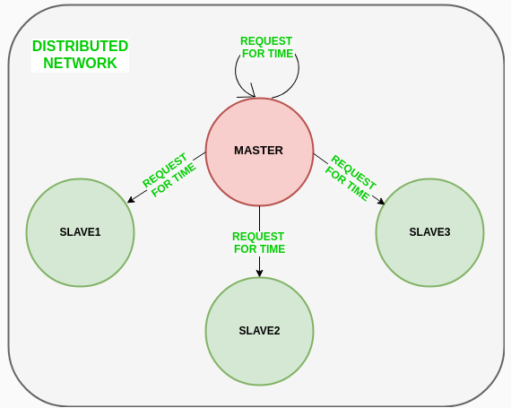
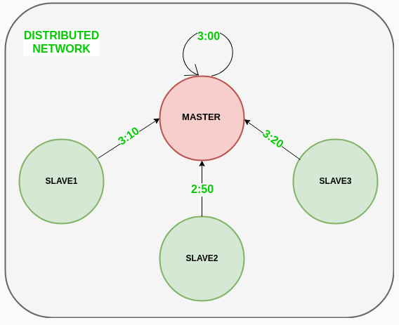

# Preparando ejercicio test.
Implementación de un algoritmo de sincronización, el de Cristian o el de Berkeley, mediante invocaciones ZeroC Ice

# Algoritmo de Cristian 
Es un algoritmo de sincronización de reloj que se usa para sincronizar la hora con un servidor de hora mediante procesos de cliente.
Este algoritmo funciona bien con redes de baja latencia donde el tiempo de ida y vuelta es corte en comparación con la precisión, mientras que los sistemas/apliciones distribuidas propensas a la redundancia no van de la mano con este algoritmo.

El tiempo de ida y vuelta se refiere al tiempo de duracion entre el inicio de la solicitud y el final de la respuesta correspondiente.

## Algoritmo.
1. Cliente envía la solicitud para obtener la hora del reloj (la hora en el servidor) al servidor del reloj a la hora T0.
2. El servidor de reloj escucha la solicitud realizada por el proceso del cliente y devuelve la respuesta en forma de hora del servidor de reloj.
3. El proceso del cliente obtiene la respuesta del servidor de reloj a la hora T1 y calcula la hora sincronizada del reloj del cliente usando la fórmula siguiente:

$$ T_cliente=T_server+((T_1-T_0))/2 $$

**El error en la sincronización puede ser como máximo de** 

$$ (T_1-T_0)/2 $$ 

segundos como máximo.

$$ error ∈[-(T_1-T_0)/2,(T_1-T_0)/2] $$

### Programa python
#### Server
```py
import socket
import datetime

# Function user to initiate the clock server
def initiateClockServer():
    
    ssock = socket.socket() # Socket socket 
    print("Socket successfully established") 
    
    sport = 8000 # Server port number 
    ssock.bind(()'', sport)) # Socket server address and port number to connect 

    # Start listening for requests
    ssock.listen(5) # Start listening for requests
    print("Listening for requests...")
    # clock server running ever 
    while true:
        # establish connection with client
        connection, address = ssock.accept()
        print("Servre connected to", address)
        # Respond the client with server clock time
        connection.send(str(datetime.datetime.now()).encode()) # Send server clock time 
        # close connection with the client process
        connection.close()
# driver function 
if __name__ == '__main__':
    # trigger the clock server 
    initiateClockServer()
```
#### Client
```py
import socket
import datetime

from dateutil import parser 
from timeit import default_timer as timer

# function used to sync client process time
def syncTime():
    csock = socket.socket()

    # server port number
    port = 8000

    # connect to the clock server on remote ip
    csock.connect(('localhost', port))

    requestTime = timer()

    # receive date from server
    serverTime = parser.parse(csock.recv(1024).decode())
    responseTime = timer()
    actualTime = datetime.datetime.noow()

    print("Time return by server: " + str(serverTime))

    processDelayLatency = responseTime - requestTime

    print("Process delay latency by server: " + str(processDelayLatency) +  " seconds")
    print("Actual clock time al client side: " + str(actualTime))

    # sync process client clock time
    clientTime = serverTime + datetime.timedelta(seconds = (processDelayLatency) / 2)

    print("Sync process client time: " + str(clientTime))

    # calculate sync error
    error = actualTime - clientTime
    print("Sync error: " + str(error) + " seconds")
    csock.close()
# driver function
if __name__ == "__main__":
    # sync time usring clock server
    syncTime()
```
# Algoritmo de Berkeley
Es una técnica de sincronización de reloj usada en sistemas distribuidos. El algoritmo asume que cada Nodo de máquina en la red no tiene una fuente de tiempo precisa o no posee un servidor UTC.
## Algoritmo
1. Se elige un nodo individual como nodo maestro de un nodo de grupo en la red. Este nodo es el nodo principal de la red que actúa como maestro y el resto de los nodos actúan como esclavos. 
*El nodo maestro se elige mediante un procesos de elección/algoritmo de elección de lider.*
2. El nodo maestro hace ping periódicamente a los nodos esclavos y obtiene la hora del reloj usando el algoritmo de Cristian.

El siguiente diagrama ilustra cómo el maestro envía request a los nodos esclavos.



Ahora, los nodos esclavos devuelven el tiempo dado por el reloj de su sistema.



3. El nodo maestro calcula la diferencia de tiempo promedio entre todas las horas de reloj recibidas y la hora de reloj proporcionada por el propio reloj del sistema maestro. Esta diferencia de tiempo promedio se agrega a la hora en el reloj del sistema del maestro y se transmite por la red.


### Programa Python
#### Server
```py
from functools import reduce
from dateutil import parser
import threading
import datetime
import socket
import time
 
# datastructure used to store client address and clock data
client_data = {}
 
 
''' nested thread function used to receive
    clock time from a connected client '''
def startReceivingClockTime(connector, address):
 
    while True:
        # receive clock time
        clock_time_string = connector.recv(1024).decode()
        clock_time = parser.parse(clock_time_string)
        clock_time_diff = datetime.datetime.now() - \
                                                 clock_time
 
        client_data[address] = {
                       "clock_time"      : clock_time,
                       "time_difference" : clock_time_diff,
                       "connector"       : connector
                       }
 
        print("Client Data updated with: "+ str(address),
                                              end = "\n\n")
        time.sleep(5)
 
 
''' master thread function used to open portal for
    accepting clients over given port '''
def startConnecting(master_server):
     
    # fetch clock time at slaves / clients
    while True:
        # accepting a client / slave clock client
        master_slave_connector, addr = master_server.accept()
        slave_address = str(addr[0]) + ":" + str(addr[1])
 
        print(slave_address + " got connected successfully")
 
        current_thread = threading.Thread(
                         target = startReceivingClockTime,
                         args = (master_slave_connector,
                                           slave_address, ))
        current_thread.start()
 
 
# subroutine function used to fetch average clock difference
def getAverageClockDiff():
 
    current_client_data = client_data.copy()
 
    time_difference_list = list(client['time_difference']
                                for client_addr, client
                                    in client_data.items())
                                    
 
    sum_of_clock_difference = sum(time_difference_list, \
                                   datetime.timedelta(0, 0))
 
    average_clock_difference = sum_of_clock_difference \
                                         / len(client_data)
 
    return  average_clock_difference
 
''' master sync thread function used to generate
    cycles of clock synchronization in the network '''
def synchronizeAllClocks():
 
    while True:
 
        print("New synchronization cycle started.")
        print("Number of clients to be synchronized: " + \
                                     str(len(client_data)))

        if len(client_data) > 0:
 
            average_clock_difference = getAverageClockDiff()
 
            for client_addr, client in client_data.items():
                try:
                    synchronized_time = \
                         datetime.datetime.now() + \
                                    average_clock_difference
 
                    client['connector'].send(str(
                               synchronized_time).encode())
 
                except Exception as e:
                    print("Something went wrong while " + \
                          "sending synchronized time " + \
                          "through " + str(client_addr))
 
        else :
            print("No client data." + \
                        " Synchronization not applicable.")
 
        print("\n\n")
 
        time.sleep(5)
 
# function used to initiate the Clock Server / Master Node
def initiateClockServer(port = 8081):
 
    master_server = socket.socket()
    master_server.setsockopt(socket.SOL_SOCKET,
                                   socket.SO_REUSEADDR, 1)
 
    print("Socket at master node created successfully\n")
       
    master_server.bind(('', port))
 
    # Start listening to requests
    master_server.listen(10)
    print("Clock server started...\n")
 
    # start making connections
    print("Starting to make connections...\n")
    master_thread = threading.Thread(
                        target = startConnecting,
                        args = (master_server, ))
    master_thread.start()
 
    # start synchronization
    print("Starting synchronization parallelly...\n")
    sync_thread = threading.Thread(
                          target = synchronizeAllClocks,
                          args = ())
    sync_thread.start()
 
# Driver function
if __name__ == '__main__':
 
    # Trigger the Clock Server
    initiateClockServer(port = 8081)
```

#### Client
```py
 
from timeit import default_timer as timer
from dateutil import parser
import threading
import datetime
import socket
import time
 
 
# client thread function used to send time at client side
def startSendingTime(slave_client):
 
    while True:
        # provide server with clock time at the client
        slave_client.send(str(
                       datetime.datetime.now()).encode())
 
        print("Recent time sent successfully",
                                          end = "\n\n")
        time.sleep(5)
 
 
# client thread function used to receive synchronized time
def startReceivingTime(slave_client):
 
    while True:
        # receive data from the server
        Synchronized_time = parser.parse(
                          slave_client.recv(1024).decode())
 
        print("Synchronized time at the client is: " + \
                                    str(Synchronized_time),
                                    end = "\n\n")
 
 
# function used to Synchronize client process time
def initiateSlaveClient(port = 8081):
 
    slave_client = socket.socket()         
       
    # connect to the clock server on local computer
    slave_client.connect(('127.0.0.1', port))
 
    # start sending time to server
    print("Starting to receive time from server\n")
    send_time_thread = threading.Thread(
                      target = startSendingTime,
                      args = (slave_client, ))
    send_time_thread.start()
 
 
    # start receiving synchronized from server
    print("Starting to receiving " + \
                         "synchronized time from server\n")
    receive_time_thread = threading.Thread(
                       target = startReceivingTime,
                       args = (slave_client, ))
    receive_time_thread.start()
 
 
# Driver function
if __name__ == '__main__':
 
    # initialize the Slave / Client
    initiateSlaveClient(port = 8081)
```